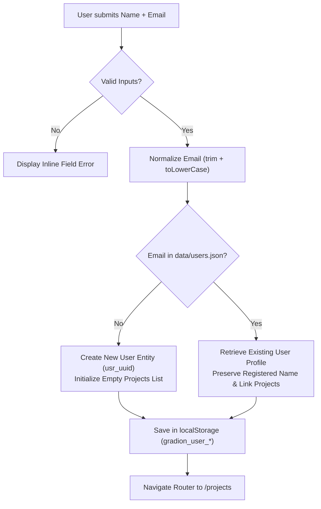
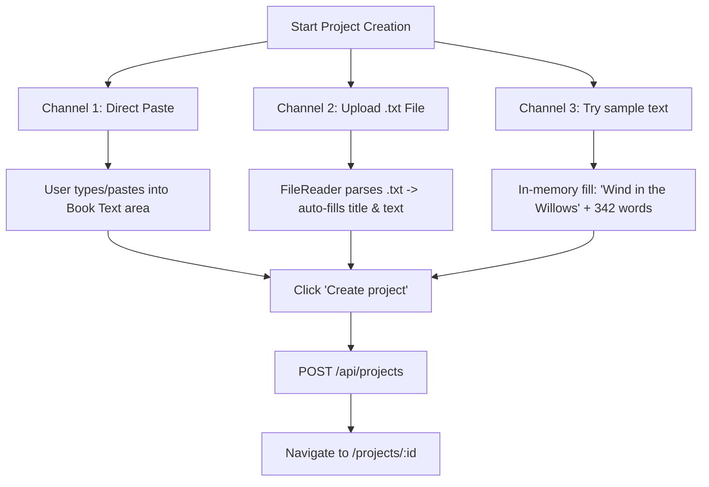

# Technical Architecture & System Specifications

## 1. System Overview

The **Book Illustration Studio** is structured as a decoupled client-server architecture with local disk persistence and direct integration with Google Gemini:

```
+-------------------------------------------------------------+
|                      React + Vite Frontend                  |
|  - Tailwind CSS + Gradion Design Tokens                     |
|  - Lucide Icons & Responsive Views                          |
|  - Stepper & Sequential Art Reveal Components               |
|  - HTML5 History API Router (/login, /projects, /projects/:id) |
|  - Live Status Polling & In-Progress Captions               |
+------------------------------+------------------------------+
                               | REST API
+------------------------------v------------------------------+
|                   Node.js / Express Backend                 |
|  - Authentication Controller (Passwordless x-user-email)    |
|  - Pipeline Orchestrator (Step sequencing & mutex locks)    |
|  - Storage Engine (Atomic JSON writes with proper-lockfile) |
|  - Asset Static Server (/api/projects/:id/assets/*)         |
+------------------------------+------------------------------+
                               | Official SDK / REST
+------------------------------v------------------------------+
|                      Google Gemini API                      |
|  - File API (Context caching for source book text)          |
|  - Gemini 2.5 Flash (Structured JSON extraction)            |
|  - Gemini 2.5 Flash Image (Nano Banana visual generation)   |
+-------------------------------------------------------------+
```

---

## 2. API Contract Specification

### Identity Endpoints
- `POST /api/auth/login`
  - Body: `{ name: string, email: string }`
  - Validation: Both `name` and `email` are strictly required (non-empty strings). Returns `400 Bad Request` on missing/invalid input.
  - Response: `{ user: { id: string, name: string, email: string, createdAt: number } }`
- `GET /api/auth/me`
  - Headers: `x-user-email: string`
  - Response: `{ user: { id: string, name: string, email: string, createdAt: number } }`

### Project Endpoints
- `GET /api/projects`
  - Headers: `x-user-email: string`
  - Response: `ProjectSummary[]` (strictly filtered by `userId`)
- `POST /api/projects`
  - Headers: `x-user-email: string`
  - Body: `{ title: string, bookText: string }`
  - Response: `Project`
- `GET /api/projects/:id`
  - Headers: `x-user-email: string`
  - Response: `Project` (returns `403 Forbidden` if project belongs to another user)

### Pipeline & Recovery Endpoints
- `POST /api/projects/:id/step/:stepKey`
  - Headers: `x-user-email: string`
  - Params: `stepKey: 'STYLE' | 'CHARACTERS' | 'PORTRAITS' | 'CHAPTERS' | 'ILLUSTRATIONS'`
  - Body (optional for STYLE): `{ customStyle?: string }`
  - Responses:
    - `200 OK`: Step completed with updated `Project`
    - `409 Conflict`: Step already in progress on this project
    - `400 Bad Request`: Prerequisite steps not met or invalid payload
    - `403 Forbidden`: Project belongs to a different user
    - `500 Internal Server Error`: Step failed, `stepState = 'FAILED'`, `lastError` recorded
- `POST /api/projects/:id/recover`
  - Headers: `x-user-email: string`
  - Response: `Project` with unlocked `stepState = 'IDLE'`
- `GET /api/projects/:id/assets/:filename`
  - Response: Image binary stream (`image/png`)

---

## 3. Business Rules & Authentication Specification (`BRD-AUTH-01`)

### 3.1 Scope & Objective
The `/login` gateway provides frictionless, passwordless identity verification (§5.2) to establish multi-tenant data boundaries across user projects without requiring third-party authentication infrastructure.

### 3.2 Field-Level Input Validation Matrix

| Field | Mandatory? | Validation Rule | Client-Side Error Response | Server-Side Error Response (`POST /api/auth/login`) |
| :--- | :--- | :--- | :--- | :--- |
| **`Full name`** | **Yes** | Non-empty string after trimming whitespace (`length > 0`). | Inline error under input: *"Please enter your full name."* + Red outline. | `400 Bad Request`<br>`{ "error": "Full name is required." }` |
| **`Email address`** | **Yes** | Must match RFC-5322 regex: `^[^\s@]+@[^\s@]+\.[^\s@]+$` | Inline error under input: *"Please enter a valid email address."* + Red outline. | `400 Bad Request`<br>`{ "error": "A valid email address is required." }` |

### 3.3 Account Provisioning & Identity Lifecycle



1. **Email Normalization:** All emails are trimmed and converted to lowercase before storage and lookup to prevent duplicate casing accounts (`ALICE@EXAMPLE.COM` → `alice@example.com`).
2. **First-Time User Registration:**
   * Generates a unique user ID: `usr_<uuid8>` (e.g. `usr_f19a3c19`).
   * Records creation timestamp `createdAt: Date.now()`.
   * Atomically appends entity to `/data/users.json`.
3. **Returning User Login (Project Resumption):**
   * Locates the existing profile by normalized email.
   * Preserves the durable registered account name.
   * Instantly grants access to all previously generated books, styles, character portraits, and chapter illustrations.

### 3.4 Multi-Tenant Boundary & Security Rules
1. **Project Ownership Tagging:** Every project entity is permanently stamped with the creator's `userId`.
2. **Access Control Enforcement:**
   * All API requests must send the `x-user-email: <email>` header.
   * If `x-user-email` is missing: Backend returns **`401 Unauthorized`**.
   * If User B attempts to view or run a pipeline step on User A's project ID: Backend returns **`403 Forbidden`**.

### 3.5 Session Lifecycle & Navigation State Machine

| Event / Route State | Trigger Condition | System Action | Target View |
| :--- | :--- | :--- | :--- |
| **Unauthenticated Access** | User visits `/projects`, `/projects/new`, or `/projects/:id` without stored user. | Route guard intercepts navigation. | Redirects to `/login`. |
| **Already Authenticated** | User visits `/login` while valid session exists in `localStorage`. | Route guard recognizes active session. | Redirects to `/projects`. |
| **Page Refresh (F5)** | User reloads page during project editing. | `AuthContext` reads `gradion_user_*` and verifies session via `GET /api/auth/me`. | Preserves active workspace route (`/projects/:id`). |
| **Explicit Sign Out** | User clicks "Sign Out" in Navbar. | Clears `gradion_user_*` from `localStorage`, resets `AuthContext`. | Redirects to `/login`. |

### 3.6 Persistent Storage Hierarchy (`/data`)
* **Unified Root `/data` Directory:**
  - All runtime project state, assets, and users are stored at the top-level repository root (`/data`).
  - `/data/users.json`: Registered user accounts.
  - `/data/projects/:id.json`: Individual project entity documents.
  - `/data/assets/:filename`: Binary PNG image files.
* **Concurrency & Safety:**
  - All JSON file updates are guarded by `proper-lockfile` advisory write locks and atomic `.tmp` rename swaps to prevent corruption.

---

## 4. Projects Dashboard Business Rules (`BRD-PROJ-LIST-01`)

### 4.1 Scope & Multi-Tenant Security Boundary
The `/projects` route serves as the tenant-isolated book library and studio dashboard:
* **Tenant Isolation:** All requests transmit the `x-user-email` header. The server returns strictly `{ projects: ProjectSummary[] }` where `project.userId === currentUser.id`.
* **Unauthorized Access:** If the session is unauthenticated or `GET /api/projects` returns `401`, the client immediately clears session state and redirects to `/login`.
* **Data Freshness:** Mounting the view triggers a fresh `GET /api/projects` fetch, ensuring pipeline updates (new characters, chapters, illustrations) are immediately reflected upon navigation.

### 4.2 State-Driven View Transitions & Display Rules

| State | Trigger Condition | Display Behavior | CTA Behavior |
| :--- | :--- | :--- | :--- |
| **Loading** | Initial mount / API in-flight | Centered spinner with `"Loading your library..."` on a clean card canvas, eliminating visual layout flicker. | Disabled / Hidden |
| **Error State** | `GET /api/projects` fails (5xx / network) | Inline error banner (`bg-red-50 border-red-200`) with `<AlertCircle />`. | Retry on refresh |
| **Empty State** | `projects.length === 0` | Full-width studio canvas (`w-full border-2 border-dashed`), `<BookPlus />` icon, text: *"Upload a book file or paste text to start generating artwork."* | Single center **`+ New project`** CTA (Header CTA hidden). |
| **Active Grid** | `projects.length > 0` | Responsive grid sorted by `updatedAt` descending (`b.updatedAt - a.updatedAt`). | Top-right **`+ New project`** CTA enabled. |

### 4.3 Responsive Viewport & Grid Contract
* **Desktop ($\ge 1024\text{px}$):** 3 columns (`lg:grid-cols-3 gap-6`).
* **Tablet ($768\text{px} - 1023\text{px}$):** 2 columns (`md:grid-cols-2 gap-6`).
* **Mobile ($< 768\text{px}$):** 1 column (`grid-cols-1 gap-4`).

### 4.4 Project Card Component Contract
Every card in the active grid renders:
1. **Title:** Multi-line clamped (`line-clamp-2 min-h-[3.25rem]`), bold, with hover color transition to Gradion Orange and native browser `title` tooltip on hover.
2. **Status Pill (`StatusPill`):** Standardized 3-state indicator (`Draft` \| `In progress` \| `Done` \| `Error`):
   - **`Draft`**: Rendered when `status === 'CREATED'`.
   - **`In progress`**: Rendered across steps 1–4. Displays an **animated pulsing dot** (`animate-pulse-dot`) during active API execution (`stepState === 'RUNNING'`), and a **static solid dot** when idle between steps.
   - **`Done`**: Rendered with an emerald checkmark when `status === 'DONE'`.
   - **`Error`**: Rendered in soft red when `stepState === 'FAILED'`.
   - Guarded with `whitespace-nowrap flex-shrink-0` to guarantee single-line badge rendering.
3. **5-Step Visual Progress Bar (`ProgressBar`):** Discrete 5-segment indicator representing progress across the 5 steps without redundant text labels.
4. **Contextual Metadata Footer:** Formatted update date (`MMM D, YYYY`), conditionally displaying character count (`X characters`) and chapter count (`X chapters`) only when $> 0$ (avoiding zero-count clutter).
5. **Navigation:** Single-click transitions the router to `/projects/:id` without full page reload.

---

## 5. New Project Creation Business Rules (`BRD-NEW-PROJ-01`)

### 5.1 Scope, Security & Route Guarding
* **BR-NEW-AUTH-01 (Authentication Guard):** Accessing `/projects/new` requires a valid active session (`gradion_user_*`). Unauthenticated navigation is intercepted immediately by client routing and redirected to `/login`.
* **BR-NEW-TENANT-01 (Tenant Isolation):** Submissions transmit the `x-user-email` header. The server assigns ownership to `currentUser.id`, isolating the new project from all other users.

### 5.2 Field Validation Matrix & Limits

| Field | Requirement | Validation Rule | Error Message / Edge Case |
| :--- | :--- | :--- | :--- |
| **Book Title** | Mandatory (`*`) | Non-empty string after `.trim()`. | `"Please provide a book title."` |
| **Book Text** | Mandatory (`*`) | Non-empty string after `.trim()`. | `"Please provide book text."` |
| **File Upload** | Optional helper | Plain text (`.txt`) UTF-8 only; **Max 5MB**. | `"File exceeds 5MB limit. Please upload a smaller text file."` |

### 5.3 Ingestion Channels & Client Behaviors



1. **Direct Paste / Typing:** User inputs or edits text directly in the `Book text` textarea.
2. **File Upload & Smart Titling:**
   - Drag-and-drop or file picker accepts `.txt` files up to 5MB.
   - **Active Drag-Over Feedback (`BR-NEW-DRAG-01`):** Dragging a file over the dropzone triggers an active Gradion Orange ring highlight and dynamically updates text to `"Release to upload .txt file"`.
   - HTML5 `FileReader` asynchronously extracts text and fills the textarea.
   - **Smart Auto-Title:** If the title field is empty, auto-derives a clean title from the filename (strips extension, converts separators to spaces).
3. **Demo Sample Autofill ("Try sample text"):**
   - In-memory load of bundled *The Wind in the Willows* prose and default title.
   - 100% pure client-side state mutation with **zero HTTP / API network requests**.
   - Resets `fileName` to `null` so the file dropzone remains in its default state.

### 5.4 Live Metrics & UI Layout Contract
* **Live Word Counter:** Dynamically calculates `bookText.trim().split(/\s+/).length`. Hidden when text is empty; renders live formatted metric `(X words)` when text exists.
* **1-Screen Form Layout:** Constrained to `max-w-3xl py-6 sm:py-8` with a non-resizable (`resize-none`) textarea to fit comfortably on 13"+ screens without vertical scrolling.
* **Spatial Wayfinding:** Left-aligned breadcrumb link (`← Projects`) above the card, keeping the `New project` card heading flush with the input fields below.

### 5.5 Submission Lifecycle & Server Initialization Contract

| Event | Condition | System Action | Target View |
| :--- | :--- | :--- | :--- |
| **Submit Click** | Form submitted | `loading = true`: Submit button label transitions to `"Creating..."` and disables click to prevent duplicate submissions (**BR-NEW-SUBMIT-01**). | In-flight state |
| **Submit Success** | Valid `title` + `bookText` | Dispatches `POST /api/projects`. Server provisions new record with **BR-NEW-INIT-01** default schema. | Immediately redirects to **`/projects/:id`** (**BR-NEW-NAV-01**) |
| **Submit Error** | Server 5xx / Network failure | Renders inline red alert banner with server error message. Re-enables form. | Stays on `/projects/new` |
| **Cancel / Exit** | Click `← Projects` or `Cancel` | Aborts creation; zero network requests sent. | Returns to **`/projects`** |

#### Default Entity Provisioning Schema (`BR-NEW-INIT-01`)
```typescript
{
  id: `proj_${uuid()}`,
  userId: currentUser.id,
  title: req.body.title.trim(),
  bookText: req.body.bookText.trim(),
  status: 'CREATED',
  stepState: 'IDLE',
  characters: [],
  chapters: [],
  createdAt: Date.now(),
  updatedAt: Date.now()
}
```

---

## 6. Data Schema Definitions

```typescript
export interface User {
  id: string;
  name: string;
  email: string;
  createdAt: number;
}

export interface CharacterEntity {
  id: string;
  name: string;
  prompt: string;
  portraitPath?: string;
  portraitReady: boolean;
}

export interface ChapterEntity {
  id: string;
  name: string;
  prompt: string;
  illustrationPath?: string;
  illustrationReady: boolean;
}

export interface Project {
  id: string;
  userId: string;
  title: string;
  bookText: string;
  geminiFileUri?: string;
  createdAt: number;
  updatedAt: number;
  status: 'CREATED' | 'STYLE_SET' | 'CHARACTERS_GENERATED' | 'PORTRAITS_GENERATED' | 'CHAPTERS_GENERATED' | 'DONE';
  stepState: 'IDLE' | 'RUNNING' | 'FAILED';
  currentRunningStep?: 'STYLE' | 'CHARACTERS' | 'PORTRAITS' | 'CHAPTERS' | 'ILLUSTRATIONS';
  stepStartedAt?: number;
  lastError?: {
    step: string;
    message: string;
    timestamp: number;
  };
  style?: string;
  characters: CharacterEntity[];
  chapters: ChapterEntity[];
}

export interface ProjectSummary {
  id: string;
  title: string;
  status: Project['status'];
  stepState: Project['stepState'];
  createdAt: number;
  updatedAt: number;
  characterCount: number;
  chapterCount: number;
}
```
