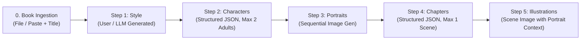

# Senior Product Manager: Book Illustration Studio — Master Plan & PRD

## Executive Summary

The **Book Illustration Studio** is an AI-assisted web application that transforms literary text into consistent visual assets (an art style, character profiles, portrait artwork, chapter scene prompts, and full chapter illustrations) using the **Google Gemini API**.

This project is an end-to-end evaluation of fullstack engineering rigor, resilient state machine architecture, UI/UX polish following the **Gradion Design System**, and disciplined AI-copilot collaboration with documented push-backs and architectural trade-offs.

---

## 1. Evaluation Contract & Assessment Objectives

To score in the top tier, this project must satisfy three core pillars:
1. **End-to-End System Reliability**:
   - **Resumable pipeline**: Survives page refreshes, tab closures, and server crashes without state loss or repeated API costs.
   - **Concurrency & Double-Execution Guard**: Server-side atomic mutex locking guarantees that double-clicks, multiple tabs, or rapid API calls cannot trigger concurrent or duplicate Gemini requests (`409 Conflict`).
   - **Strict Enforcements**: Hard server-side caps (**max 2 adult characters**, **max 1 chapter**) and token cost discipline (uploading/caching book text once, reusing context across steps).
2. **AI Copilot Proof of Work (`docs/DECISIONS.md`)**:
   - Documented **10 architectural decisions** outlining proposals, pushbacks, trade-offs, and costs.
   - **4 explicit AI overrides** where AI suggestions were rejected for being incorrect, unsafe, or misaligned with spec constraints.
   - "One More Day" roadmap vision.
3. **UI/UX Polish & Accessibility**:
   - Faithful adoption and enhancement of the **Gradion Design System** tokens (`--grad-orange`, `--grad-ink`, typography, responsive cards, sequential visual reveals).
   - Real loading states, error boundaries, retry affordances, and stale-step recovery.

---

## 2. Product Architecture & Comprehensive Tech Stack

### Complete Architectural Decision Matrix

| Layer / Area | Final Selection | Technical Rationale & Exact Mechanics |
| :--- | :--- | :--- |
| **Backend Engine** | **Node.js / Express (TypeScript) (`/backend`)** | Explicit REST endpoints, robust handling of async Gemini streams, clean separation of concerns, zero framework magic. |
| **Frontend Framework** | **React + Vite (TypeScript) (`/frontend`)** | Instant Hot Module Replacement (HMR), clean component lifecycle, fast builds. |
| **Design System & Styling** | **Tailwind CSS (Gradion Tokens) + `lucide-react`** | Direct token mapping to `app-demo.html` (`--grad-orange`, `--grad-ink`, `--grad-paper`, border radii, font scales) + modern vector iconography. |
| **State Persistence** | **Local JSON Files + `proper-lockfile`** | Project-isolated JSON state files (`/data/projects/:id.json`) guarded by advisory write locks for safe concurrent file updates. Zero external DB setup friction (§5.2). |
| **Asset & Image Storage** | **Local Filesystem (`/data/projects/:id/assets/`)** | Local image storage served directly via Express endpoint `GET /api/projects/:id/assets/:filename` with `image/png` headers. Strictly no S3/blob/CDN (§5.2). |
| **AI Text & Schema Model** | **`gemini-2.5-flash`** | Sub-second latency (~0.8s–1.2s), 100% deterministic JSON output via native `responseSchema`, 1M+ token context window, 15 RPM free tier limit. |
| **AI Visual Art Model** | **`gemini-2.5-flash-image` (Nano Banana)** | Official Gemini multimodal image generation family specified in §5.3 and the Google Cookbook. Follows style prompts and character visual consistency. |
| **Concurrency Guard** | **Atomic Server-Side Mutex (`409 Conflict`)** | In-memory atomic synchronous lock reservation (`activeLocks`) combined with persistent disk state checks. Returns `409 Conflict` on simultaneous triggers before async I/O begins. |
| **Resilience & Recovery** | **Dual State Machine (`status` + `stepState`) + `/recover`** | `status` tracks durable milestones (`CREATED` → `DONE`), `stepState` tracks transient execution (`IDLE`, `RUNNING`, `FAILED`). Stranded locks time out after 60s (`STUCK_TIMEOUT_MS`) with manual/automatic recovery. |
| **Identity & Multi-Tenancy** | **Passwordless Name + Email (`x-user-email` Header)** | Local user identity stored in `users.json`. Projects isolated by `userId`; User B receives `403 Forbidden` on User A's projects. |
| **Client-Side Routing** | **HTML5 History API (`/login`, `/projects`, `/projects/:id`)** | Standard browser HTML5 History API (`window.history.pushState` / `popstate`) with `<Link>` and `useRouter()`. Native support in Vite dev server and production Express static fallback. |
| **In-Progress UI Updates** | **Optimistic State + Live Contextual Captions** | Instant button lock, pulse animation, descriptive running captions (e.g. *"Generating structured character prompts..."*), and status polling. |
| **Testing Harness** | **Vitest + Supertest + React Testing Library** | Unified, fast native TypeScript/ESM test execution across backend (`backend`) and frontend (`frontend`). |
| **Developer CLI Scripts** | **Dedicated Shell Scripts (`./start.sh` & `./test.sh`)** | Single-command developer experience for evaluators per §5.5. |
| **Git Hygiene & Security** | **Comprehensive `.gitignore` + Granular Commits** | Guarantees `.env` (Gemini API keys), `node_modules`, and runtime `/data` are never committed (§5.3 & §06). |

---

## 3. The 5-Step Pipeline Specification (Aligned with Gemini Cookbook)



### Detailed Step-by-Step Mechanics

| Step # | Step Key | Input Context | Model & Prompt Strategy | Output Schema / Asset | Hard Constraints & Cookbook Rules |
| :--- | :--- | :--- | :--- | :--- | :--- |
| **0** | **Ingestion** | `.txt` upload or pasted text + title | Cached locally on disk + single Gemini context reference | Initialized project entity with status `CREATED` | Ingested once; reused across all subsequent pipeline steps. |
| **1** | `STYLE` | Book Manuscript + Optional User Style String | `gemini-2.5-flash` (`generateContent`) | Unified Art Style descriptor string | If user provides text, respect and enrich it; otherwise derive from narrative tone, period, and atmosphere. |
| **2** | `CHARACTERS` | Book Text + Established Art Style | `gemini-2.5-flash` with JSON `responseSchema` | `CharacterEntity[]`: `[{ id, name, prompt, portraitReady }]` | **Hard cap: Exactly/Max 2 adult characters**. Prompt describes clothing, age, facial features, and style. |
| **3** | `PORTRAITS` | Character Prompts + Art Style + Negative Instructions | `gemini-2.5-flash-image` (Nano Banana) | PNG binary assets saved to `/data/projects/:id/assets/` | Generated sequentially; UI reveals each portrait as it completes. Embeds negative instructions. |
| **4** | `CHAPTERS` | Book Text + Art Style + Character Profiles | `gemini-2.5-flash` with JSON `responseSchema` | `ChapterEntity[]`: `[{ id, name, prompt, illustrationReady }]` | **Hard cap: Exactly/Max 1 chapter**. Prompt incorporates character visual cues established in Step 2. |
| **5** | `ILLUSTRATIONS` | Chapter Prompt + Character Traits + Art Style | `gemini-2.5-flash-image` (Nano Banana) | PNG binary asset saved to `/data/projects/:id/assets/` | Scene illustration maintaining strict visual consistency with character portraits. Project marked `DONE`. |

### Cookbook Negative System Instructions (Embedded in Steps 3 & 5)
```text
There must be no text, labels, signatures, nor titles on the image.
It should not look like a book cover or poster.
It should be a full illustration with no borders, frames, nor multiple panels.
Stay family-friendly with rich atmospheric lighting.
```

---

## 4. State Machine & Concurrency Locking Engine

### Project State Data Model
```typescript
interface Project {
  id: string;
  userId: string;
  title: string;
  bookText: string;
  createdAt: number;
  updatedAt: number;
  status: 'CREATED' | 'STYLE_SET' | 'CHARACTERS_GENERATED' | 'PORTRAITS_GENERATED' | 'CHAPTERS_GENERATED' | 'DONE';
  stepState: 'IDLE' | 'RUNNING' | 'FAILED';
  currentRunningStep?: 'STYLE' | 'CHARACTERS' | 'PORTRAITS' | 'CHAPTERS' | 'ILLUSTRATIONS';
  stepStartedAt?: number;
  lastError?: {
    step: string;
    message: string;
    timestamp: number;
  };
  style?: string;
  characters: Array<{
    id: string;
    name: string;
    prompt: string;
    portraitPath?: string;
    portraitReady: boolean;
  }>;
  chapters: Array<{
    id: string;
    name: string;
    prompt: string;
    illustrationPath?: string;
    illustrationReady: boolean;
  }>;
}
```

### Mutex & Concurrency Mechanics
1. **Synchronous In-Memory Reservation**:
   - `PipelineMutex` maintains a synchronous in-memory `Set<string>` (`activeLocks`).
   - When `/api/projects/:id/step/:stepKey` is called, `activeLocks.add(projectId)` executes *synchronously before any `await`*, eliminating async race windows.
   - If already locked, the endpoint immediately returns `409 Conflict`.
2. **Stranded Lock Timeout & Safe Recovery**:
   - If `stepState === 'RUNNING'` and `Date.now() - stepStartedAt > 60000`, the lock is flagged as stranded.
   - The `/api/projects/:id/recover` endpoint safely releases the lock and resets `stepState = 'IDLE'`, allowing user-triggered retry without losing completed steps.

---

## 5. Frontend UI/UX Architecture (Gradion Design System)

### View Hierarchy & Components
1. **Navbar (`Navbar.tsx`)**: Gradion logo, project navigation link, user initials avatar, name, and Sign out action.
2. **Auth Screen (`AuthPage.tsx`)**: Name & Email validation (passwordless, persistent local identity).
3. **Project Dashboard (`ProjectListPage.tsx`)**: Project cards with `StatusPill` (`Draft`, `In progress`, `Done`), 5-segment mini progress bar, created date, and "+ New project" CTA. Empty state illustration when zero projects exist.
4. **New Project Ingestion (`NewProjectPage.tsx`)**: Title input, drag-and-drop `.txt` dropzone with live name indicator, and direct text paste textarea.
5. **Project Workspace (`ProjectDetailPage.tsx`)**:
   - Interactive 5-step horizontal Stepper (`Done` ✓ / `Current` ⭘ / `Pending`).
   - Sticky Sidebar: Full book text preview with modal reader ("Read full text →") and active Style Card.
   - Action Command Panel: Contextual action button, custom style input for Step 1, active progress indicators with specific running step captions.
   - Live Entity Grids:
     - Character Cards (Aspect ratio 3:4, name, visual prompt, animated spinner placeholder, rendered portrait image).
     - Chapter Cards (Aspect ratio 16:9, name, narrative prompt, scene illustration art card).
   - Error & Stale Banner: Contextual alert with clear error messaging and explicit "Retry Step" action.
6. **Book Modal (`BookModal.tsx`)**: Modal reader with Escape key listener and backdrop click-to-close.

---

## 6. Testing Strategy & Verification Protocols (`docs/TESTING.md`)

- **Backend Automated Tests (`backend/tests/`)**:
  - `pipeline.test.ts`: Validates step sequencing invariant, 5-step happy path, concurrency rejection (`409 Conflict`), and stranded lock recovery.
  - `caps_and_auth.test.ts`: Verifies strict server caps (max 2 characters, max 1 chapter), multi-tenant isolation (`403 Forbidden`), and PNG static image asset streaming headers.
- **Frontend Automated Tests (`frontend/src/__tests__/`)**:
  - `Stepper.test.tsx`: Step labels, active ring-pulse animations, and completed milestone checkmarks.
  - `StatusPill.test.tsx`: Correct rendering across `Draft`, `In progress`, and `Done` states.
  - `BookModal.test.tsx`: Book title, manuscript text, accessibility attributes, and keyboard Escape close handling.
- **Raw Test Report**:
  - Raw, unedited terminal output from running `./test.sh` automatically captured in `docs/TESTING.md`.

---

## 7. Deliverables Checklist & Compliance Matrix

| Deliverable | Location | Requirements & Acceptance Criteria |
| :--- | :--- | :--- |
| **Start Script** | `./start.sh` | Single command that checks node environment, installs dependencies, and boots fullstack dev servers. |
| **Test Script** | `./test.sh` | Single command that runs all backend and frontend test suites and exits with code 0. |
| **Decisions Log** | `docs/DECISIONS.md` | 10 architectural decisions with trade-offs, **4 explicit AI overrides**, and "One More Day" roadmap. Linked in `README.md`. |
| **Testing Strategy** | `docs/TESTING.md` | Complete testing philosophy + raw output from a real `./test.sh` test run. Linked in `README.md`. |
| **Environment Config** | `.env.example` | Clear template with `GEMINI_API_KEY`, `GEMINI_TEXT_MODEL=gemini-2.5-flash`, `GEMINI_IMAGE_MODEL=gemini-2.5-flash-image`, `BACKEND_PORT=3001`, `FRONTEND_PORT=3000`. |
| **Git Security Config** | `.gitignore` | Ignores `.env`, `node_modules/`, `data/`, `dist/`, build artifacts, and logs. |
| **AI Context Artifacts** | `AGENTS.md`, `docs/plan.md` | Native Antigravity project context rules, commands, and planning documentation. |
| **Documentation Index** | `README.md` | Quickstart guide, architecture overview, API endpoint reference, and index of all `/docs` files. |
